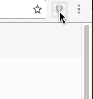
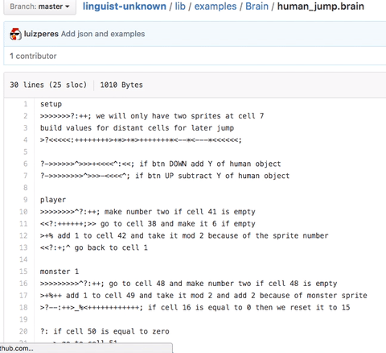
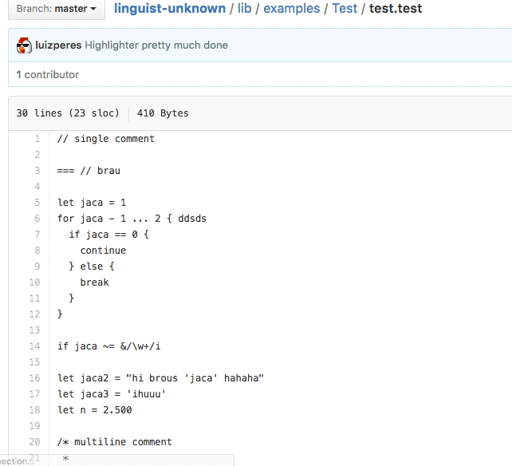

<p align="center">
	
</p>

<p align="center">
<a href="#"></a>
<a href="#"></a>
<a href="#"></a>
<a href="#"></a>
</p>

# Linguist Unknown
> This repository is used as a Web Browser extension for the website GitHub.com in order to detect and highlight unknown, lost or new programming languages.

See  [`CONTRIBUTING.md`](/CONTRIBUTING.md) before creating a pull request.

# 

- [Why](#why-should-you-download-it)
- [Download](#how-can-i-download-and-use-it)
- [Check if Linguist Unknown works](#how-do-i-know-if-it-works)
  - [Check if your yaml is valid](#how-do-i-know-my-yaml-is-valid)
- [Highlighting a new language](#how-to-highlight-my-languages)
- [Examples](#examples)
- [Documentation](#documentation)
    - [Multiple Languages](#multiple-languages-in-same-repo)
    - [extensions](#extensions)
    - [default_color](#default_color)
    - [id_color](#id_color)
    - [number_color](#number_color)
    - [string_color](#string_color)
    - [comment_color](#comment_color)
    - [single_line_comment](#single_line_comment)
    - [begin_multiline_comment](#begin_multiline_comment)
    - [end_multiline_comment](#end_multiline_comment)
    - [grammar](#grammar)
      - [color](#color)
      - [keywords](#keywords)
      - [operators](#operators)
      - [regexes](#regexes)
- [Contributing](#contributing)
- [License](#license)

### Why should you download it?
There are numerous cool languages out there whose syntaxes are not being highlighted on `GitHub`. That happens because the [Linguist Project](https://github.com/github/linguist) targets only the main existent programming languages.

Because of that, most of the time it is frustrating to see a new-or-unknown-language source code. `Linguist Unknown` is a project that helps new, lost or unknown languages to be visualized on GitHub. It helps you to do what you already do on your favorite Text Editor.

We believe that all languages should be highlighted on GitHub; just the way it should always be. :) There is an ocean of programming languages out there and by downloading `Linguist Unknown` you're making every drop of this ocean count!

### How can I download and use it?
__Two Simple Steps__:
- Install the [Google Chrome Plugin](https://chrome.google.com/webstore/detail/linguist-unknown/oohlobhfikieeeldgalkkkaojcaebclk) or the [Firefox Plugin](#) (on hold).
- Make sure it is active.



### How do I know if it works?
After [downloading and installing it](#how-can-i-download-and-use-it), visit one (or all) of the link(s):
- [./examples/C/io.c](https://github.com/github-aux/linguist-unknown/blob/chrome/examples/C/io.c)
- [./examples/Brain/human_jump.brain](https://github.com/github-aux/linguist-unknown/blob/chrome/examples/Brain/human_jump.brain)
- [./examples/Brainfuck/hellbox.bf](https://github.com/github-aux/linguist-unknown/blob/chrome/examples/Brainfuck/hellbox.bf)
- [./examples/Test/test.test](https://github.com/github-aux/linguist-unknown/blob/chrome/examples/Test/test.test)

__If__ they're `highlighted`, you're good to go!

#### How do I know my YAML is valid?
Please read the [documentation](#documentation) and check if your YAML is valid  [here](https://nodeca.github.io/js-yaml/)

### How to highlight my language(s)?
1. [Download](#how-can-i-download-and-use-it) and install `Linguist Unknown`.
2. Add a file named `.linguist.yml` into the root of your GitHub repository to tell `Linguist Unknown` your language(s) grammar(s).
3. Write your grammar(s) rules. The example below tells `Linguist Unknown` that you have a programming language called `Foo` whose extensions are `.foo` and `.bar`. It also tells that `Foo`'s single linge comment is defined by `//`, whereas its multiline comments are defined by `/*` and `*/`. Last but not least, it defines the color of your tokens i.e. __id_color__ _(identifier color)_, __number_color__. It also helps you to define the color groups of your grammar's `keywords`, `operators` and customizable `regexes`
```
Foo:
  extensions:
    - ".foo"
    - ".bar"
  default_color: "#808A9F"
  id_color: "#333333"
  number_color: "#FF6600"
  string_color: "#333300"
  comment_color: "#CCF5AC"
  single_line_comment: "//"
  begin_multiline_comment: "/*"
  end_multiline_comment: "*/"
  
  grammar:
    - color: "#72EEBB"
      operators:
        - "==="
        - ">="
      keywords:
        - "int"
        - "float"
      regexes:
        - regex: "&(amp;)\/[^\/]*\/([\\S]?)*"
          modifier: ""
    
    - color: "#FF00FF"
      keywords:
        - "if"
        - "else"
        - "switch"
        - "let"
```
4. Test it. Go to `/path/to/file.foo` or `/path/to/file.bar` and check if is highlighted! Simple as that!

### Examples

##### Brain Language

```
Brain:
  extensions:
    - ".br"
    - ".brain"
  default_color: "#969896"
  
  grammar:
    - color: "#a71d5d"
      operators:
        - ">"
        - "<"
        - "^"
        - "&lt;"
        - "&gt;"
        
    - color: "#333333"
      operators:
        - "["
        - "]"
        - "{"
        - "}"
        - "?"
        - ":"
        - ";"
        - "!"
        
    - color: "#0086b3"
      operators:
        - "+"
        - "-"
        - "*"
        - "/"
        - "%"
        - "_"
    
    - color: "#795da3"
      operators:
        - "."
        - ","
        - "$"
        - "#"

```

###### Output

<p>

</p>

##### Test

```
Test:
  extensions:
    - ".test"
  default_color: "#FF8272"
  comment_color: "#969896"
  id_color: "#FF99FF"
  number_color: "#FF6600"
  string_color: "#333300"
  single_line_comment: "//"
  begin_multiline_comment: "/*"
  end_multiline_comment: "*/"
  
  grammar:
    - color: "#72EEBB"
      keywords:
        - "for"
        - "while"
      regexes:
        - regex: "&(amp;)\/[^\/]*\/([\\S]?)*"
          modifier: ""
    
    - color: "#FF00FF"
      keywords:
        - "if"
        - "else"
        - "switch"
        - "let"
```

##### Output

<p>

</p>


### Documentation

##### Multiple languages in same repo
It's simple, in your `.linguist.yml`:
```
Foo:
  extensions:
    - ".foo"
  ... other rules
  
Bar:
  extensions:
    - ".bar"
  ... other rules
```

##### extensions
List of extensions for your language.
```
  extensions:
    - ".ext1"
    - ".ext2"
```

##### default_color
The default color for your language. All tokens with `undefined` color will have this color. If this color is not defined, it will use `GitHub`'s default color: `#24292e`
```
  default_color: "#F00BAF"
```

##### id_color
The color for your language's `identifiers`. If this color is `undefined`, it will user the property `default_color` instead.
```
  id_color: "#F00BAF"
```

##### number_color
The color for your language's `numbers`. If this color is `undefined`, it will user the property `default_color` instead.
```
  number_color: "#F00BAF"
```

##### string_color
The color for your language's `strings`. If this color is `undefined`, it will user the property `default_color` instead.
```
  string_color: "#F00BAF"
```

##### comment_color
The color for your language's `comments`. If this color is `undefined`, it will user the property `default_color` instead.
```
  string_color: "#F00BAF"
```

##### single\_line\_comment
The __lexeme__ for your single line comments, such as `//`, `#` and others
```
  single_line_comment: "//"
```

##### begin\_multiline\_comment
The __lexeme__ for the begin of your multiline comments, such as `/*`, `{` and others
```
  begin_multiline_comment: "/*"
```

##### end\_multiline\_comment
The __lexeme__ for the end of your multiline comments, such as `*/`, `}` and others
```
  begin_multiline_comment: "*/"
```

##### grammar
Represents a list of color rules for your `keywords`, `operators` and others. Example
```
  grammar:
    - color: "#F00BAF"
      keywords:
        - "if"
        - "while"
        - "for"
    - color: "#333333"
      keywords:
        - "int"
        - "float"
      operators:
        - "==="
        - "!=="
        - "=="
    - color: "FF0000"
      regexes:
        - regex: "&(amp;)\/[^\/]*\/([\\S]?)*"
          modifier: ""
        - regex: "^#(?:[0-9a-fA-F]{3}){1,2}"
          modifier: "i"
```

###### color
Defines the `color group` for your `keywords`, `operators` and others (such as `regexes`). If `undefined`, it will user the property default_color instead.
```
  grammar:
    - color: "#F00BAF"
      ...
```

###### keywords
Defines a list of `keywords` for a grammar color group.
```
  grammar:
    - color: "#F00BAF"
      keywords:
        - "if"
        - "else"
```

###### operators
Defines a list of `operators` for a grammar color group.
```
  grammar:
    - color: "#F00BAF"
      operators:
        - "=="
        - "!="
        - ">"
``` 

###### regexes
Defines a list of `regexes` for a grammar color group. The `regexes` properties can be used as a property that may identify custom `lexemes` not included by `Linguist Unknown`. For example, imagine that `#FFFFFF` is a valid lexeme in your language, to highlight it with red color, you would most likely do:
```
  grammar:
    - color: "#FF0000"
      regexes:
        - regex: "^#(?:[0-9a-fA-F]{3}){1,2}"
          modifiers: ""
``` 

### Contributing
Feel free to send your pull requests. :)

### LICENSE
This project extends [GNU GPL v. 3](http://www.gnu.org/licenses/gpl-3.0.en.html), so be aware of that, regarding copying, modifying and (re)destributing.


